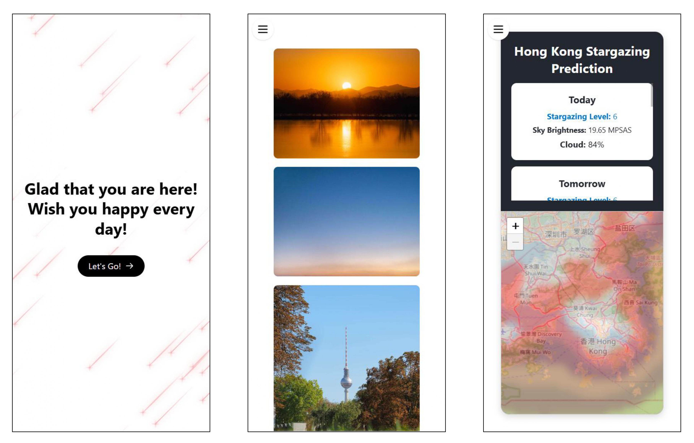
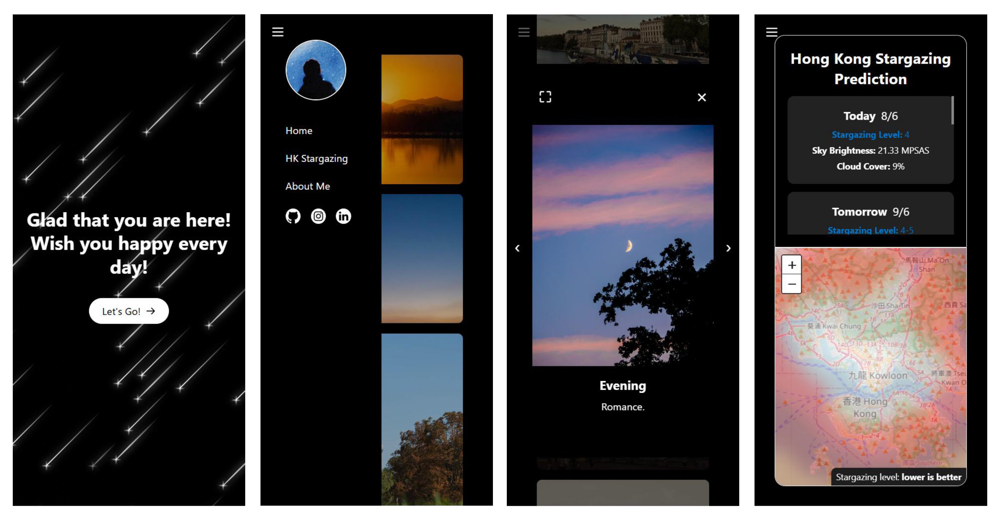
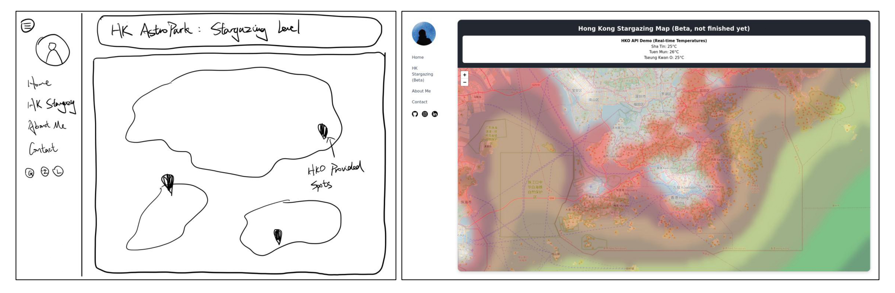
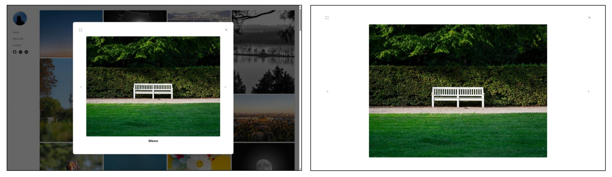
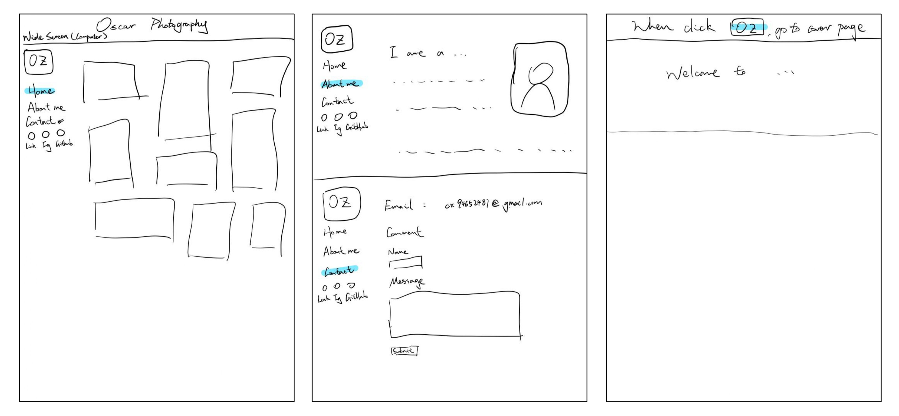

# WestCoastGod Photography

Link to the website: https://westcoastgod-photography.vercel.app/



# Project Structure & Setup

- **`Frontend`**: React + Vite application (Website)
- **`Backend`**: FastAPI + Python application (AI Models & Stargazing API), Hosted on Hugging Face

## To Run Locally

### 1. Frontend (Website)
```bash
cd frontend
npm install
npm run dev
```

### 2. Backend (API)
```bash
cd backend
pip install -r requirements.txt
uvicorn main:app --reload
```

# Future Ideas

- Set up Google Search Console to make the website searchable
- Add notes to the stargazing prediction website

# Development Logs

## 11/10/2025

- Adjust photo columns to fit ultrawide screen (up to 7 columns)
- Adjust welcome page stars number based on device performance and screen size
- Add SEO optimization: meta tags, sitemap, robots.txt for Google Search indexing
- Set up Google Search Console verification

## 11/06/2025

- Add animation and SVG figure to sidebard and About Me page, referenced from [Antoine Wodniack](https://codepen.io/wodniack/pen/abyoKEa)

## 08/06/2025

- Add dark mode to the website, automatically change according to user system
  

## 29/05/2025

- Add pre-trained prediction Random Forest model
- Add weather api from [Open_Meteo](https://open-meteo.com/), of 35 weather elements for 7 days forecast
- Deployed the backend in [Render](https://render.com/)

## 27/05/2025

- Initiate Hong Kong Stargazing Page
- Light pollution map source from [Mr. David Lorenz](https://djlorenz.github.io/astronomy/lp/), blurred using Gaussian blur in Photoshop
  

## 24/05/2025

- Add more photos and descriptions
- Cancel enlargment window scroller
- Enhance image fade-in animation

## 23/05/2025

- Enhance UI fluency, now Home page photos fade in after fully loading
- Adjust photo description alignment to the left

## 22/05/2025

- Add full screen viewing photo mode, previous photo and next photo buttons
  

## 21/05/2025

- Add photo enlargement window
- Enhance fluency of Welcome page shooting stars
- Add show and hide button for sidebar
- Deployed the frontend in [Vercel](https://vercel.com/)

## 20/05/2025

- Improve old website project from 2023 summer
- Add Welcome, Home, About me, and Contact page, with last two as drafts
- Enhance shooting star animation, add greetings and let's go button
- Add photos to Home page, adapts Waterfall Design
- Deploy website at Vercel
- Lo-Fi Website Design
  
